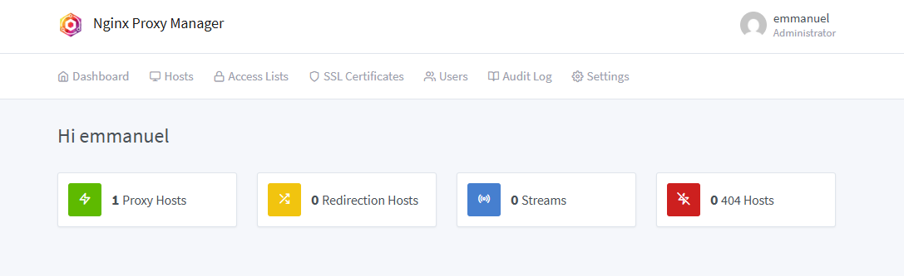

# Utiliser un certificat Let's Encrypt sous Home Assistant

## Installation de l'addon Nginx Proxy Manager

Lien : [Nginx Proxy Manager](https://github.com/hassio-addons/addon-nginx-proxy-manager)

## Configuration avant démarrage

